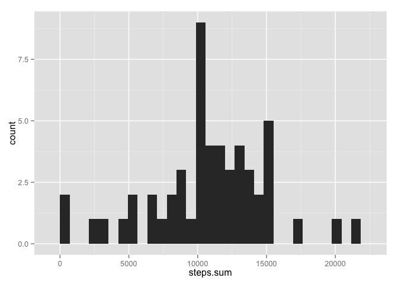
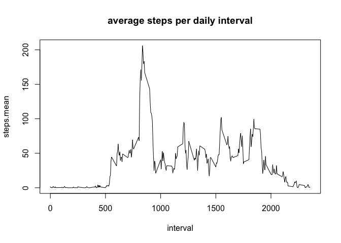
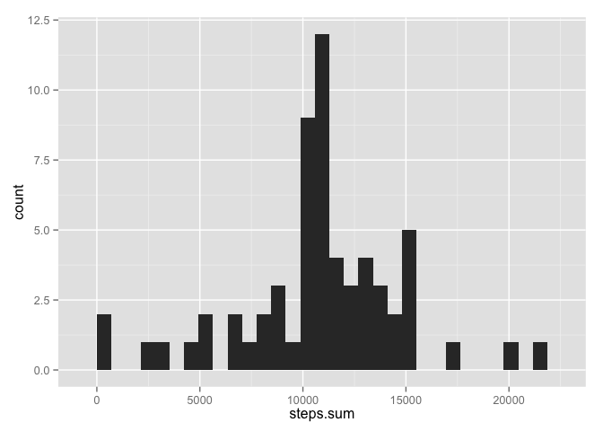
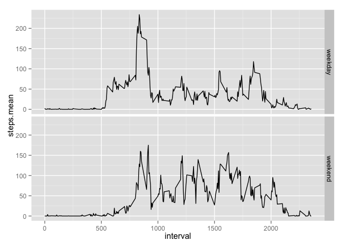

# Reproducible Research: Peer Assessment 1
Berner Setterwall  
15 Nov 2015  


```r
library(doBy)
```

```
## Loading required package: survival
## Loading required package: splines
```

```r
library(ggplot2)
```

```
## Warning: package 'ggplot2' was built under R version 3.1.3
```

## Loading and preprocessing the data


```r
dataset <- read.csv("activity.csv")
dataset$date <- as.Date(dataset$date)
summary(dataset)
```

```
##      steps             date               interval     
##  Min.   :  0.00   Min.   :2012-10-01   Min.   :   0.0  
##  1st Qu.:  0.00   1st Qu.:2012-10-16   1st Qu.: 588.8  
##  Median :  0.00   Median :2012-10-31   Median :1177.5  
##  Mean   : 37.38   Mean   :2012-10-31   Mean   :1177.5  
##  3rd Qu.: 12.00   3rd Qu.:2012-11-15   3rd Qu.:1766.2  
##  Max.   :806.00   Max.   :2012-11-30   Max.   :2355.0  
##  NA's   :2304
```

## What is mean total number of steps taken per day?


```r
dataset.byDay <- summaryBy(steps ~ date, dataset, FUN=sum)
qplot(steps.sum, data=dataset.byDay, geom="histogram")
```

```
## stat_bin: binwidth defaulted to range/30. Use 'binwidth = x' to adjust this.
```

 

The original dataset have a mean of 10766.2 and a median of 10765 steps per day.

## What is the average daily activity pattern?


```r
dataset.byInterval <- summaryBy(steps ~ interval, na.omit(dataset), FUN=mean)
plot(dataset.byInterval, type = "l")
title("average steps per daily interval")
```

 

**Which 5-minute interval, on average across all the days in the dataset, contains the maximum number of steps?**


```r
dataset.byInterval[dataset.byInterval$steps.mean == max(dataset.byInterval$steps.mean), ]
```

```
##     interval steps.mean
## 104      835   206.1698
```

## Imputing missing values

**Calculate and report the total number of missing values in the dataset (i.e. the total number of rows with NAs)**


```r
nrow(dataset[is.na(dataset), ])
```

```
## [1] 2304
```

**Devise a strategy for filling in all of the missing values in the dataset. The strategy does not need to be sophisticated. For example, you could use the mean/median for that day, or the mean for that 5-minute interval, etc.**

I'll use an linear regression model to fill the NA's, based on the date and the interval.

```r
reg.data <- dataset
reg.data$date <- as.numeric(reg.data$date)

dataset.cleaned <- dataset
#na.predictions <- predict(lm(steps ~ date + interval, reg.data), reg.data[is.na(reg.data)])
steps.model <- lm(steps ~ date + interval, reg.data)
```

**Create a new dataset that is equal to the original dataset but with the missing data filled in.**

Filling the NA's in the steps column results in a dataset (`dataset.cleaned`) without NA's.


```r
dataset.cleaned[is.na(dataset.cleaned), 'steps'] <- predict(steps.model, reg.data[is.na(reg.data), ])
nrow(dataset.cleaned[is.na(dataset.cleaned), ])
```

```
## [1] 0
```

### What is mean total number of steps taken per day of the cleaned dataset?

```r
dataset.cleaned.byDay <- summaryBy(steps ~ date, dataset.cleaned, FUN=sum)
qplot(steps.sum, data=dataset.cleaned.byDay, geom="histogram")
```

```
## stat_bin: binwidth defaulted to range/30. Use 'binwidth = x' to adjust this.
```

 

The cleaned dataset have a mean of 10767.2 and a median of 10781.1 steps per day.

Compared to the original dataset's mean of 10766.2 and a median of 10765 steps per day. So by predicting NA's this way instead of dropping them, daily number of steps have increased slightly.

## Are there differences in activity patterns between weekdays and weekends?


```r
dataset$typeOfDay <- 'weekday'
dataset[ weekdays(dataset$date) == 'Saturday'
       | weekdays(dataset$date) == 'Sunday'
         , 'typeOfDay'] <- 'weekend'
dataset$typeOfDay <- as.factor(dataset$typeOfDay)

summary(dataset)
```

```
##      steps             date               interval        typeOfDay    
##  Min.   :  0.00   Min.   :2012-10-01   Min.   :   0.0   weekday:12960  
##  1st Qu.:  0.00   1st Qu.:2012-10-16   1st Qu.: 588.8   weekend: 4608  
##  Median :  0.00   Median :2012-10-31   Median :1177.5                  
##  Mean   : 37.38   Mean   :2012-10-31   Mean   :1177.5                  
##  3rd Qu.: 12.00   3rd Qu.:2012-11-15   3rd Qu.:1766.2                  
##  Max.   :806.00   Max.   :2012-11-30   Max.   :2355.0                  
##  NA's   :2304
```

```r
dataset.byIntervalToD <- summaryBy(steps ~ interval + typeOfDay, na.omit(dataset), FUN=mean)

p <- ggplot(dataset.byIntervalToD, aes(interval, steps.mean))+ geom_line()
p + facet_grid(typeOfDay ~ .)
```

 

